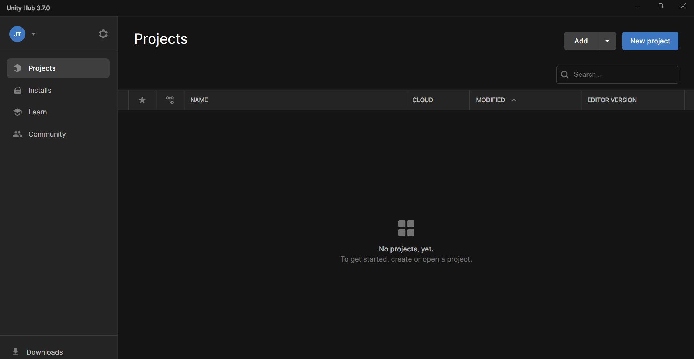

Welcome to this GitHub repository where we will be implementing a real-time communication between a web browser and the Unity environment.
First of all, open the unity editor. 

The version of the Unity which we are using in this project is 2022.3.23f1
As it can be seen, in the second image, we just created a new project called  Real-time communication.

