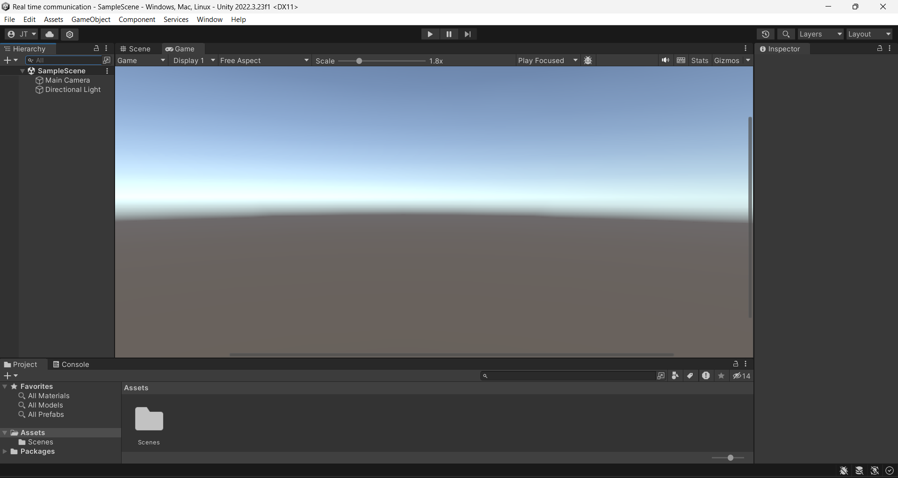
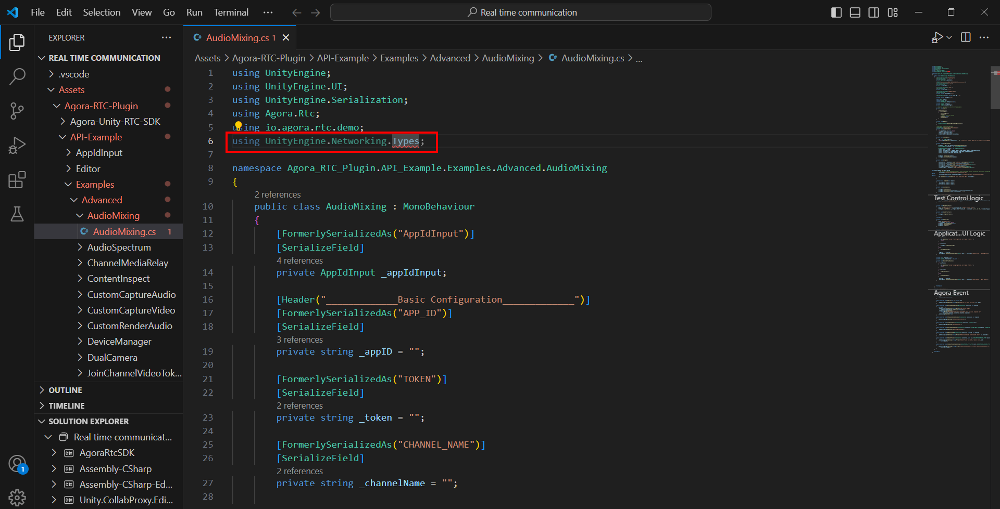
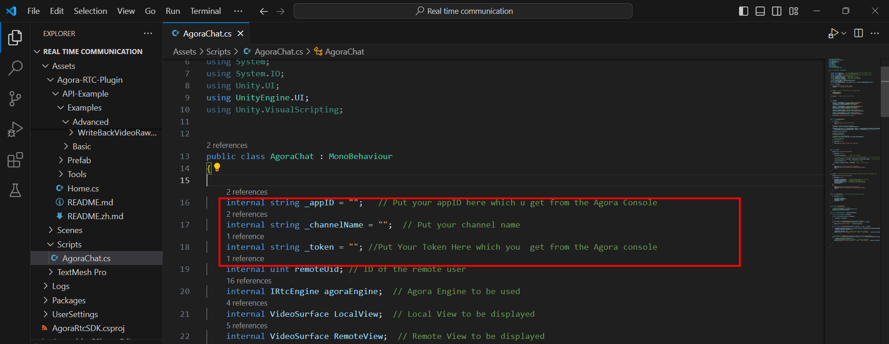

Welcome to this GitHub repository where we will be implementing a real-time communication between a web browser and the Unity environment.
First of all, open the unity editor. 

The version of the Unity which we are using in this project is 2022.3.23f1. As it can be seen, in the second image, we just created a new project called  Real-time communication.

In the following image we can see that, the unity project is getting opened.

After opening the project, we will be having the following window.

Now, we are going to create a canvas where we will be having four UI components. They are two raw image components and two buttons.
We will be having two raw image components in order to display the local and the remote video respectively. We will be having two buttons with the text "Join" and "Leave" in order to start and  end the communication. In order to create canvas, right click on the sample scene area and choose UI, and from there, we'll choose canvas.

After creating the canvas, we will be having it in the scene.

Now, we are going to create two buttons with the text "Join" and "Leave" respectively.In order to create the button, we can follow the following procedure. 
First of all, we are going to right click on the sample scene area, and from there we can follow the following procedure shown in the image.

For the Join Button,  give the positions  of X and Y: -350 and  -172 respectively.
For the Leave Button, give the positions of X and Y: 350 and -172 respectively.
By the way, do not forget to give the buttons text.
After setting up the buttons, we will be having the following window.

Since we are done with the buttons, we can continue with raw **image components ** in order to display the local and remote videos respectively.
In order to create raw image component, please follow the following procedure. Right click on the sample scene, from their click on the UI and choose raw image.

Create the first raw image component with the following parameters. ** posX: -250,  posY: 0,  Width: 250,  Height: 250**.
Do not forget to change the name of the raw image component to the  **LocalViewObject**. 

For remote video, use the same steps to create a RawImage called RemoteViewObject with the following parameters.  **posX: 250,  posY: 0,  Width: 250 , Height: 250**.
Do not forget to change the name of the raw image component to the  **RemoteViewObject**. 

Now since we are done with the basic UI setup, we can continue with importing the Agora video SDK into the unity environment. In order to download the unity with your SDK , please refer to the following link. https://docs.agora.io/en/sdks?platform=unity 
At the time of creating this GitHub repository, the version of the video SDK which we are using for the unity is 4.3.0. Since the volume of the video SDK is huge we couldn't upload it on this GitHub repository, that's why you can download it directly from the Agora website. 
Once we have downloaded the video SDK in the zip format, will be having the following file shown in the middle of image.

We have the unzip this file and we will be having the following file shown in the below given image.

After this step, I have to follow the following my steps in order to import this SDK into the unity environment.

After that, we will be having the following window, and we have to press import which is shown in the below give image. 

Press "Yes, for these and other files that might be found later " shown in the below given image. 
After importing the video SDK, we might be having the following problem shown in the below given image.

In order to solve this problem, just open the file or maybe just double click on the red error message and  you will be taken to the file  where you are having the problem with the import which is highlighted in the below given image.

Simply, delete the import line which is highlighted in the below image.

After deleting in the Unity environment, we'll be having the following and press the highlighted part.

Now as we can see in the following image, Agora  video SDK has been imported into the Unity environment.

Now we are going to create an empty game object which will be used in order to control our script. In order to create a new game object, we have the right click on the sample scene area and from there we are going to choose create empty option. The full procedure is shown in the below given image.

We are going to rename this empty game object by giving it the name called **GameController**. It is shown below.

Now in the assets folder, we are going to create a new folder called  "Scripts" and this folder contains C# script to make everything possible.
In order to do that, right click on the assets folder, from their choose  **create** and choose **folder** option (Full procedure is shown below).

After creating the folder with, we will be having the following.

Now we are going to open the scripts folder, and in the script all that we are going to create new C# script. We are going to right click on the empty Script  folder and from there we are going to create new C# script by the following step by step procedure. We are going to name this file AgoraChat.

Simply attach this script to the empty game object called the GameController.
After attaching the script,  we can see from the inspector window of the game object called GameController that the script has been attached successfully.

Now, open the script which is given in this GitHub repository called **AgoraChat** and copy the code from the script into the C# file that you created in your project
As you probably know, in order to run this project to make this real-time communication possible between the unity and the web browser, we have to rely on the Agora (https://www.agora.io/en/) . From the Agora developer console, we have to get app ID and temporary token which is valid  for 24 hours. Actually, if you do not want to use this temporary token which you are obtaining from the Agora developer console, you can create your own server which deals with token generation. 
Now I'll show you how to obtain this app ID and temporary token. If you haven't created Agora account before, you have to do so by following the on-screen prompts.
At the time of creating this this GitHub repository, there are two version of the console: old and new. Below I am providing the link for the both versions.

**Old console version:** https://console.agora.io/
**New console version:**  https://console.agora.io/v2
We are working with the new version of the console since it's more convenient
Create a new project, by choosing the option called "New Project".

When you are creating a new project, for the security, please choose app ID and token.
After having the app ID and token, please replace the empty strings in the script with the actual app ID and the token which you got from the Agora website.

Here do not forget to set the channel name which in my case is **"UnityChatWithWeb"**.
Having had app ID, token and channel name. Now you can establish the communication successfully.
After running the script, and joining on the web part we can have the following your job.
In order to make the communication possible on the web part, we used the following demo website:  https://webdemo.agora.io/basicVideoCall/index.html
After establishing you communication, we have the following results.

**If you have any questions regarding this GitHub Repository, you can let us know by opening a new issue on this repository.**
**References**
1. https://www.agora.io/en/
2. Video SDK documentation: https://api-ref.agora.io/en/video-sdk/unity/4.x/API/rtc_api_overview.html
3. https://agora-support.vcube.com/hc/ja/articles/14887384244377-Video-SDK-for-Unity-4-x-%E3%82%AF%E3%82%A4%E3%83%83%E3%82%AF%E3%82%B9%E3%82%BF%E3%83%BC%E3%83%88
4. https://www.agora.io/en/blog/agora-video-sdk-for-unity-quick-start-programming-guide/
5. https://docs.agora.io/en/video-calling/get-started/get-started-sdk?platform=unity
6. Web site part to check: https://webdemo.agora.io/basicVideoCall/index.html
   

 

 

 

 

