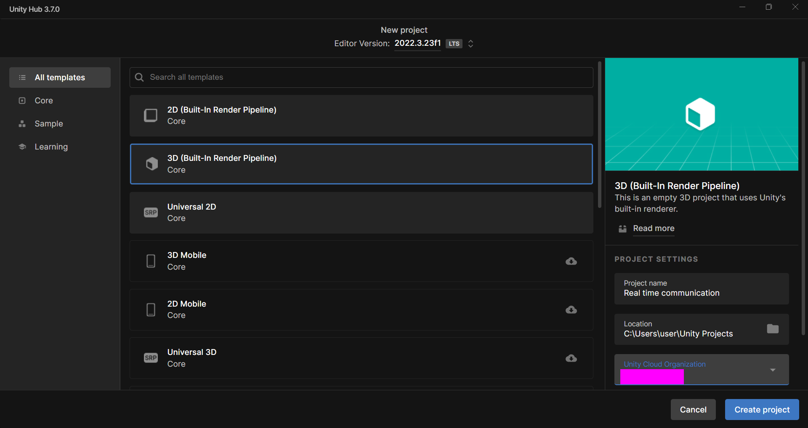

Welcome to this GitHub repository where we will be implementing a real-time communication between a web browser and the Unity environment.
First of all, open the unity editor. 

The version of the Unity which we are using in this project is 2022.3.23f1. As it can be seen, in the second image, we just created a new project called  Real-time communication.

In the following image we can see that, the unity project is getting opened.

After opening the project, we will be having the following window.

Now, we are going to create a canvas where we will be having four UI components. They are two raw image components and two buttons.
We will be having two raw image components in order to display the local and the remote video respectively. We will be having two buttons with the text "Join" and "Leave" in order to start and  end the communication. In order to create canvas, right click on the sample scene area and choose UI, and from there, we'll choose canvas.

After creating the canvas, we will be having it in the scene.

Now, we are going to create two buttons with the text "Join" and "Leave" respectively.In order to create the button, we can follow the following procedure. 
First of all, we are going to right click on the sample scene area, and from there we can follow the following procedure shown in the image.

For the Join Button,  give the positions  of X and Y: -350 and  -172 respectively
For the Leave Button, give the positions of X and Y: 350 and -172 respectively
By the way, do not forget to give the buttons text.
After setting up the buttons, we will be having the following window.

 

